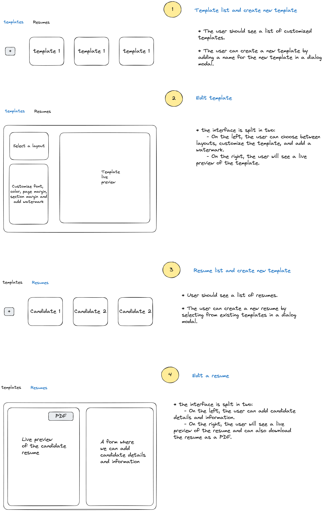

# Manatal: resume builder

Stack:

- [react](https://www.npmjs.com/package/react):
  - JavaScript library for creating user interfaces
- [react-router-dom](https://www.npmjs.com/package/react-router-dom)
  - declarative routing
- [react-hook-form](https://www.npmjs.com/package/react-hook-form)
  - Managing our forms
- [zod](https://www.npmjs.com/package/zod)
  - for schema validation
- [Zustand](https://docs.pmnd.rs/zustand/getting-started/introduction):
  - for managing our global store
- [Tailwind](https://ui.shadcn.com/docs/installation/manual)
  - utility css framework
- [shadcn](https://ui.shadcn.com/)
  - component library
- [react-pdf](https://react-pdf.org/)
  - to preview/download PDF

Build Tool:

- [Vite](https://www.npmjs.com/package/vite): `npm create vite@latest resume-builder -- --template react-ts`
  - Our build tool for development and production

# Assignment:

- Requirements: [link](https://www.notion.so/Build-a-Resume-Builder-for-Recruitment-Agencies-113c1a7ce6614758bccdd31ecbcc6791?pvs=21)
- A simple POC for managing resume templates and candidate resumes
- User can customize the template (font size, color, margin, watermark,…) and download the resume as a PDF

# Implementation plan:

- We have two stories:
  - for managing templates where the user can customize the template
  - for managing resumes where the user can select an existing template and add candidate details and information in order to download the resume as a PDF
- The POC could have the following web interface. Each step is marked with a number with a yellow background



## Project Structure

For this POC we choose to have a decoupled approach with a `data layer` `domain layer` and a `view layer`. This approach will make it easier to scale and change the `data layer` from a store to an API for instance.

```
src/
├── shared/
│   ├── components/   # shadcn/ui components
│   └── form/         # form controllers
│   └── ...           # other shared folders and files
└── app/
    └── templates/
        ├── data/     # data layer
        │   └── template.service.ts
        ├── domain/   # domain layer
        │   └── template-entity.ts
        └── view/     # view layer
            └── template-list/
                └── create-new-template/
                    └── index.tsx
                └── ...  # other view components and files

```

## step 1 & 2: template list and create/edit template

- we add a new route `/templates`
- In our `domain layer` we need interfaces/types:

```tsx
export type Template = {
  uuid: UUID;
  name: string;
  config: TemplateConfig;
};

export type TemplateConfig = {
  layout: Layout;
  fontSize: Size;
  fontFamily: string;
  color: Color;
  pageMargin: Size;
  sectionMargin: Size;
  watermark: string;
};
```

- we need a dialog modal with `input text` for the creation of a new template
- when user submits for a new template a new id will be generated with the user’s input template name and the template configuration will have default values
- For the purpose of this POC our `data layer` will be a simple store that persists data in local storage using `zustand`

```tsx
type TemplateStoreType = {
  templates: Array<Template>;
  createTemplate: (name: string) => void;
  updateTemplateById: (id: UUID, updatedTemplate: Template) => void;
  getTemplateById: (id?: UUID) => Template | undefined;
  deleteTemplateById: (id: UUID) => void;
};
```

- for the `view layer` we are going to need several components

```
templates/
├── data/
├── domain/
└── view/
    ├── customize-layout/
    ├── layout-selection/
    └── template-list/
    └── template-details/
```

- Note that we want to display a live preview of the template while the user is customizing it. So we can display a PDF preview using `react-pdf` and we can reuse that same component for the resume details view

```
src/
├── app/
│   ├── templates/
│   └── resumes/
└── shared/
    └── candidate-resume/
        └── index.tsx
```

- in `template-details` we can use the `candidate-resume` like this:

```tsx
//
type CandidateResumeProps = {
  candidateDetails?: CandidateDetails;
  currLayout?: Layout;
  templateConfig?: TemplateConfig;
  isDummy?: boolean;
  showToolbar?: boolean;
};

//
<CandidateResume
  isDummy={true}
  currLayout={currLayout}
  templateConfig={currTemplate?.config}
/>;
```

## step 3 & 4: resume list and create/edit resume

- we add a new route `/resumes`
- Our `domain layer` needs new types

```yaml
export type Resume = {
  uuid: UUID;
  candidateDetails?: CandidateDetails;
  templateId: UUID;
};

export type CandidateDetails = {
  firstName: string;
  lastName: string;
  email: string;
  phoneNumber: string;
  address: string;
  experiences: Array<Experience>;
  education: Array<Education>;
  certifications: Array<Certification>;
  description: string;
  references: Array<string>;
  linkedin: string;
  skills: Array<Skill>;
};
```

- we need a dialog modal with a list of existing templates in order to add a new resume
- when user submits for a new resume a new id will be generated with the selected template id.
- Our `data layer` has two use cases: one for the resumes and another for the list of available templates. We use `zustand` and a custom react hook:

```tsx
// resume.service.ts
type TemplateStoreType = {
  resumes: Array<Resume>;
  createResume: (templateId: UUID) => void;
  updateResumeById: (id: UUID, updatedTemplate: Resume) => void;
  getResumeById: (id?: UUID) => Resume | undefined;
  deleteResumeById: (id: UUID) => void;
  updateTemplateId: (id: UUID, templateId: UUID) => void;
};

// templates.service.ts
import useTemplateStore from "@/app/templates/data/template.service";

export const useGetTemplates = () => {
  const templates = useTemplateStore((x) => x.templates);
  const getTemplateById = useTemplateStore((x) => x.getTemplateById);
  return {
    templates,
    getTemplateById,
  };
};
```

- for the `view layer` we are going to need as well a few components

```
resumes/
├── data/
├── domain/
└── view/
    ├── candidate-form/
    └── resume-list/
    └── resume-details/
```

- in `resume-details` we can use the `candidate-resume` like this. Note that the `showToolbar` props will allow the user to download the PDF

```tsx
<CandidateResume
  currLayout={template?.config.layout}
  templateConfig={template?.config}
  candidateDetails={candidateDetails}
  showToolbar
/>
```

# Quickstart

- `npm i`
- `npm run preview`
